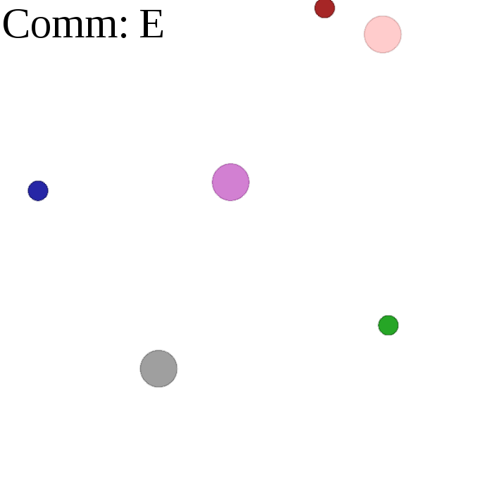

# multiagent-comm

This is the repository of Mihir Patel, Nikhil Sardana, and Vinjai Vale for our CS 234 (Reinforcement Learning) final project, "Multi-Agent Cooperation Against Adversarial Agents Through Communication." The final report is available [here](https://nikhilsardana.github.io/multiagentcomm.pdf).

This project is an exploration of communication in multi-agent reinforcement learning. We mostly considered the performance and behavior of the [MADDPG algorithm](https://arxiv.org/abs/1706.02275) in more complex environments, along with the parameterization of communication. Hence, this codebase is forked from [openai/maddpg](https://github.com/openai/maddpg) and [openai/multiagent-particle-envs](https://github.com/openai/multiagent-particle-envs).

To set up this repository, please see the instructions in [`ENVIRONMENT.md`](https://github.com/fractal1729/multiagent-comm/blob/master/ENVIRONMENT.md). This is the README from the Multi-Agent Particle Environment repository.

Our additions include two complex cooperative/competitive environments involving communication. These are:

* `multiagent/scenarios/adversary_simple_listener.py`. An adversarial agent is added to `simple_speaker_listener`. The speaker/listener pair must learn encrypt communication to reach the goal while preventing an adversary from doing the same.

* `multiagent/scenarios/commplex_tag.py`. Predators are given communication abilities in `simple_tag` but have vision restricted and the environment becomes partially observable.

<kbd></kbd>

  

Above: Our adversarial speaker-listener environment. The small circles are the landmarks. In each episode, a random landmark is chosen to be the target. Only the speaker (grey) knows the target's identity. The speaker cannot move, instead, it can only communicate over a public channel to a listener and adversary (purple). The listener and adversary both move during the episode to minimize their distance to the target. The speaker must use a private key (shared with only the listener) and public communication to tell the listener the identity of the target landmark without disclosing it to the adversary. In the figure above, the listener is colored a light shade of the target. As shown above, when the adversary receives noise instead of communication, it learns to find the centroid of the three landmarks.
  

